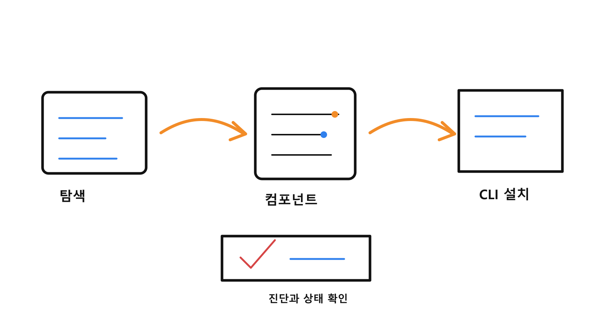

# claude-code-templates 워크플로우 현행

작성일: 2026-07-01

## 한 줄 정의

`claude-code-templates`는 Claude Code용 agents, commands, settings, hooks, MCP, skills, 프로젝트 템플릿을 모아 설치·관리하는 외부 템플릿 컬렉션이다.

## 한눈에 보는 흐름

1. 사용자는 CLI 또는 대시보드에서 필요한 컴포넌트를 탐색한다.
2. agents, commands, hooks, MCP, settings, skills 중 필요한 묶음을 선택한다.
3. CLI가 현재 프로젝트의 Claude Code 설정에 컴포넌트를 설치한다.
4. health check, analytics, plugin dashboard로 설치 상태를 확인한다.
5. 기여 또는 업데이트 시 라이선스와 출처를 보존한다.

## 주요 구성

| 영역 | 역할 |
| --- | --- |
| `cli-tool` | 템플릿 설치와 진단 CLI |
| `docs` | 웹 문서와 컴포넌트 설명 |
| `api`, `dashboard` | 템플릿 탐색과 관리 UI/API |
| `cloudflare-workers` | 보조 워커와 모니터링 기능 |
| `components` | agents, commands, hooks, MCP, skills 묶음 |

## 관련 위치

- 프로젝트 루트: `D:\AI\claude-code-templates`
- 기준 README: `D:\AI\claude-code-templates\README.md`
- 현행 문서: `D:\AI\claude-code-templates\docs\claude-code-templates_워크플로우_현행.md`
- 삽화 폴더: `D:\AI\claude-code-templates\docs\visuals\2026-07-01-claude-code-templates-workflow`

## 민감정보 경계

템플릿 설치 예시는 공개 컴포넌트 이름만 남기고, 프로젝트 ID, 인증값, 원격 접속 정보, 개인 설정값은 문서에 넣지 않는다. 외부 템플릿을 실제 프로젝트에 적용하기 전에는 각 컴포넌트의 동작 범위를 확인한다.
